# zabbix 4.0安装和添加主机(ubuntu)
## 安装zabbix
获取zabbix源
```bash
# wget https://repo.zabbix.com/zabbix/4.0/ubuntu/pool/main/z/zabbix-release/zabbix-release_4.0-2+bionic_all.deb
# dpkg -i zabbix-release_4.0-2+bionic_all.deb
# apt update
```
安装Zabbix server，web前端，agent
```bash
# apt -y install zabbix-server-mysql zabbix-frontend-php zabbix-agent
```
## 数据库相关操作
创建数据库并授权
```bash
MariaDB [(none)]> create database zabbix character set utf8 collate utf8_bin;
MariaDB [(none)]>  grant all privileges on zabbix.* to zabbix@'192.168.27.%' identified by '123456';
```
修改数据库配置文件
```bash
#ubuntu上mysql默认监听在127.0.0.1上需要修改
root@mylinuxops:~# vim /etc/mysql/mariadb.conf.d/50-server.cnf
bind-address            = 192.168.27.10
#重启服务设置为开机启动
root@mylinuxops:~# systemctl restart mariadb
root@mylinuxops:~# systemctl enable mariadb
```
导入数据库
```bash
root@mylinuxops:~# zcat /usr/share/doc/zabbix-server-mysql*/create.sql.gz | mysql -uzabbix -p123456 -h192.168.27.10 zabbix
```
编辑配置文件 /etc/zabbix/zabbix_server.conf配置zabbix连接数据库参数
```bash
#配置以下几项
root@mylinuxops:~# vim /etc/zabbix/zabbix_server.conf
#数据库连接地址
DBHost=192.168.27.10
#数据库名
DBName=zabbix
#连接数据库的用户
DBUser=zabbix
#连接数据库的密码
DBPassword=123456
#数据库的端口
DBPort=3306
```
为Zabbix前端配置PHP
编辑配置文件 /etc/zabbix/apache.conf,修改时区
```bash
root@mylinuxops:~# vim /etc/zabbix/apache.conf 
        php_value date.timezone Asia/Shanghai
```
启动Zabbix server和agent进程，并为它们设置开机自启
```bash
root@mylinuxops:~# systemctl restart zabbix-server zabbix-agent apache2
root@mylinuxops:~# systemctl enable zabbix-server zabbix-agent apache2
```
配置Zabbix前端web
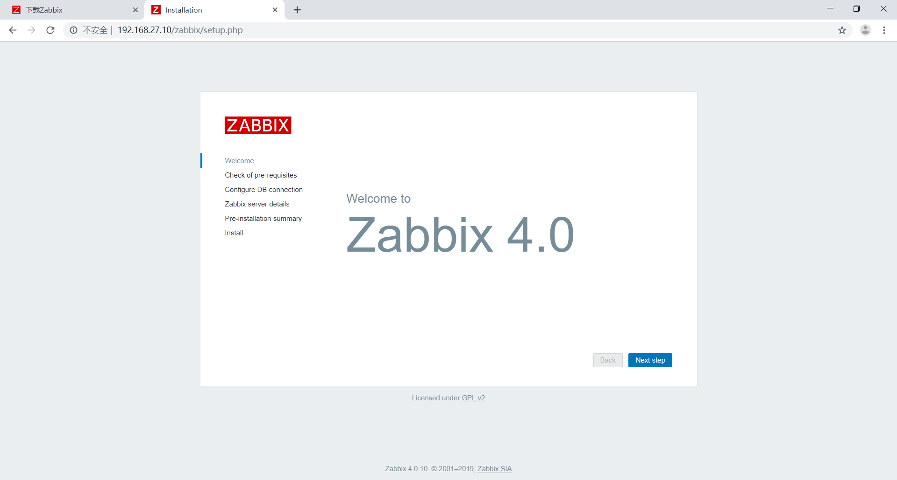
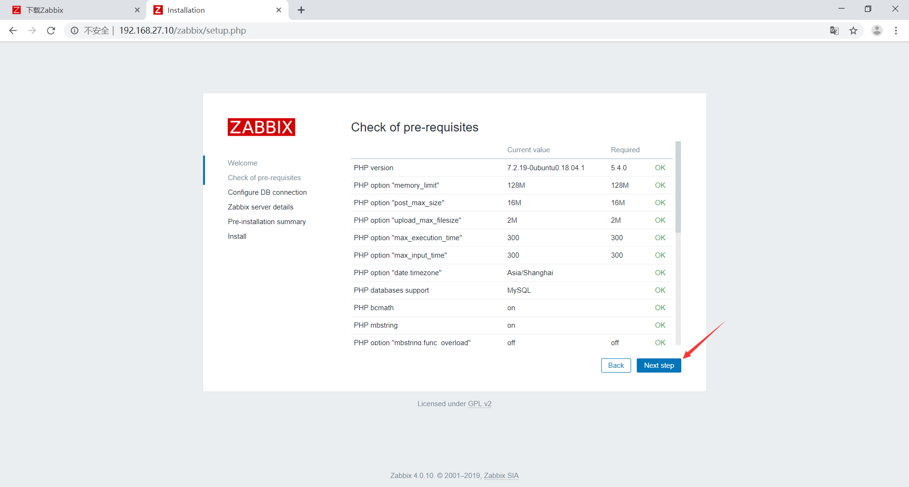
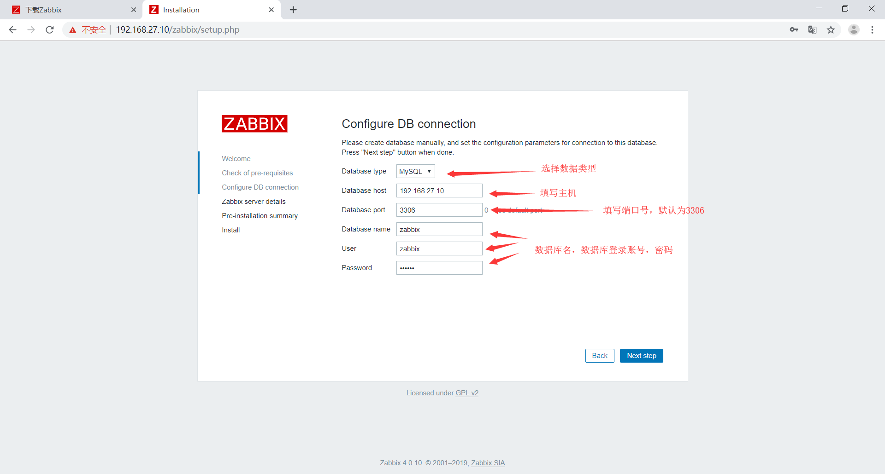
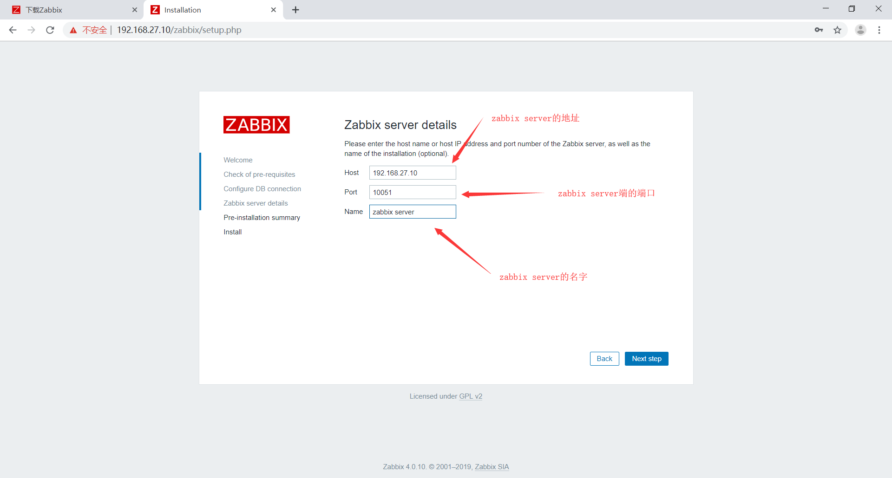
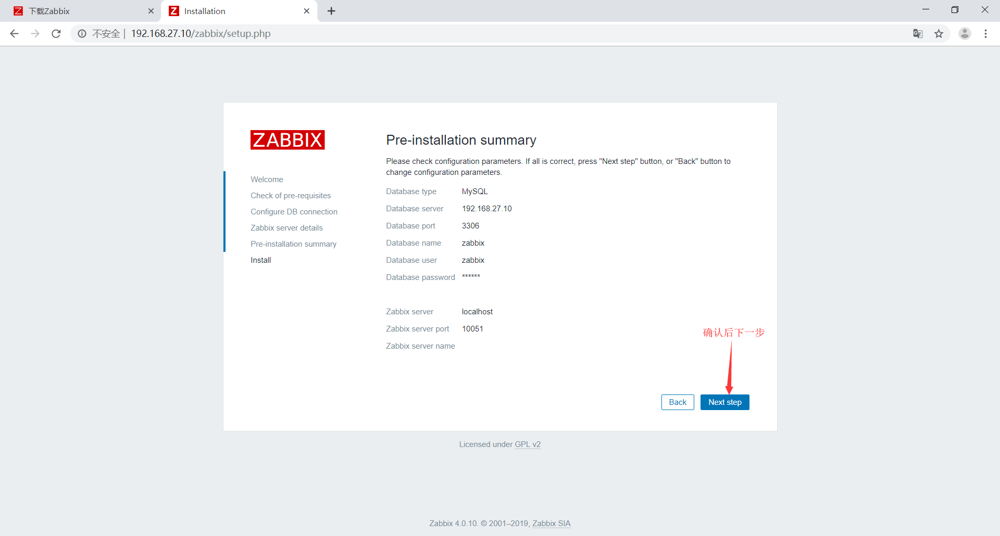
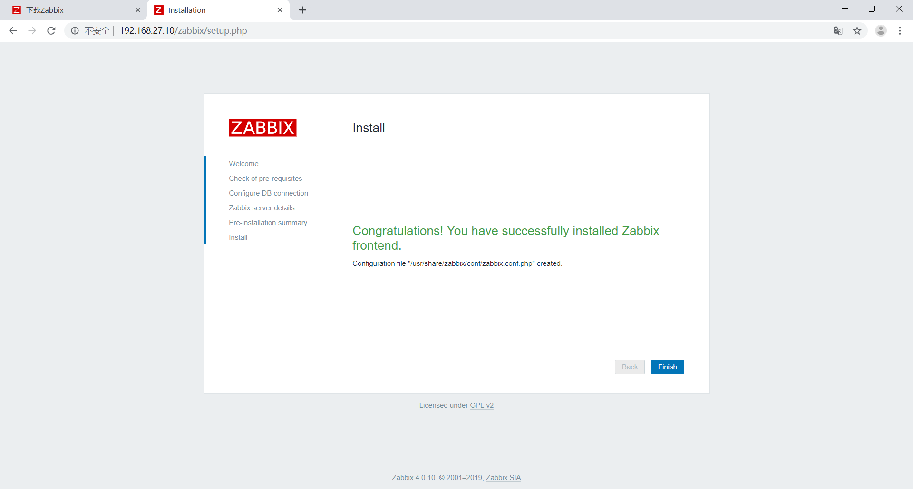
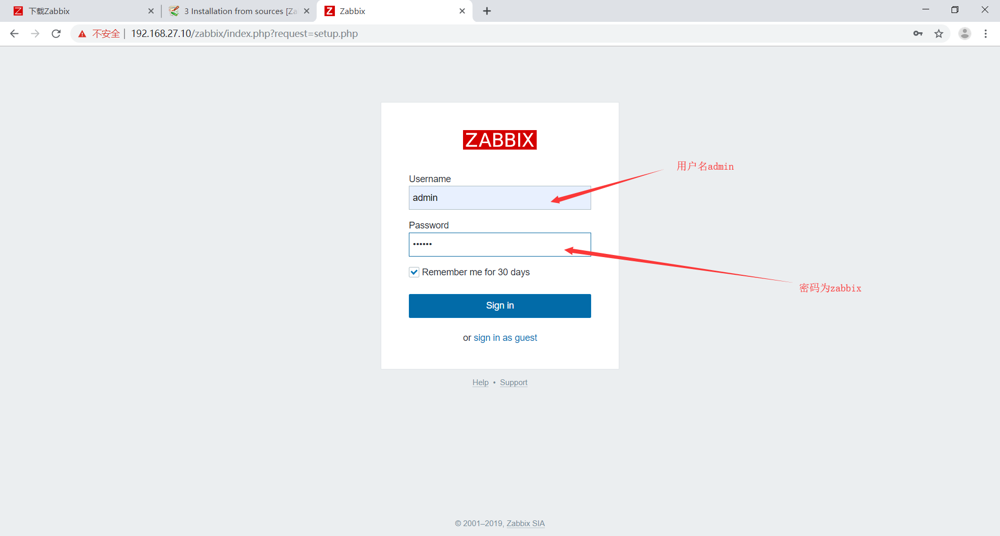
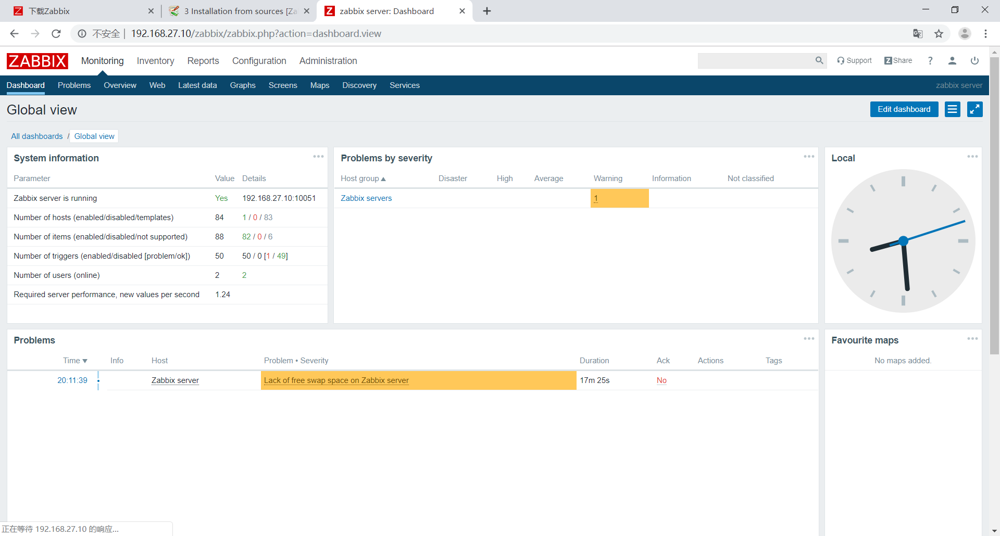
## zabbix中文设置
安装中文语言包
```bash
root@zabbix:~# apt install language-pack-zh*
```
修改环境变量，添加中文环境
```bash
LANG="zh_CN.UTF-8"
LANGUAGE="zh_CN:zh:en_US:en"
```
更改语言
```bash
root@zabbix:~# dpkg-reconfigure locales
#在语言选择选项里选择以下选项
zh_CN.UTF-8 UTF-8
zh_CN.UTF-8
```
导入windows字体，在windows的C:\windows\fonts下有各种中文字体，导出中文字体上传到zabbix-server的/usr/share/zabbix/assets/fonts/目录下
```bash
root@zabbix:~# cd /usr/share/zabbix/assets/fonts/
root@zabbix:/usr/share/zabbix/assets/fonts# ls
graphfont.ttf  simkai.ttf
```
修改字体配置文件
```bash
root@zabbix:/usr/share/zabbix/assets/fonts# vim /usr/share/zabbix/include/defines.inc.php 
#将以下参数修改为上传的字体，simkai
define('ZBX_GRAPH_FONT_NAME',           'simkai'); // font file name
define('ZBX_FONT_NAME', 'simkai');
```
字体修改完毕
## agent方式添加主机
更新zabbix源
```bash
wget https://repo.zabbix.com/zabbix/4.0/ubuntu/pool/main/z/zabbix-release/zabbix-release_4.0-2+bionic_all.deb
dpkg -i zabbix-release_4.0-2+bionic_all.deb
apt update
```
安装zabbix agent
```bash
root@zabbix:~# apt install zabbix-agent
```
修改agent配置文件
```bash
root@mylinuxops:~# vim /etc/zabbix/zabbix_agentd.conf 
#指定server为zabbix-server
Server=192.168.27.10
#指定地址为zabbix-server
ServerActive=192.168.27.10
#修改主机名
Hostname=mylinuxops
```
重启服务
```bash
root@mylinuxops:~# systemctl restart zabbix-agent.service 
```
在zabbix的web界面上添加主机
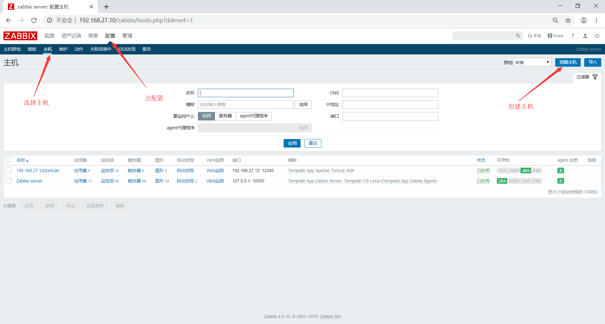
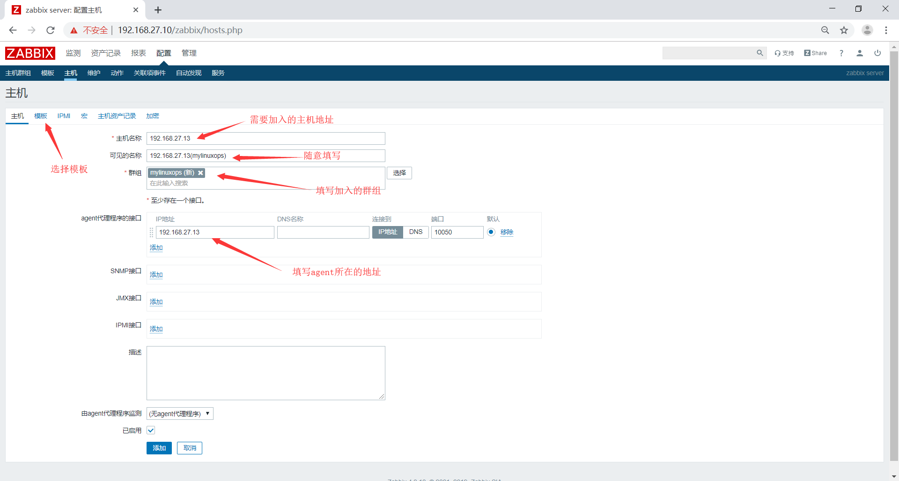
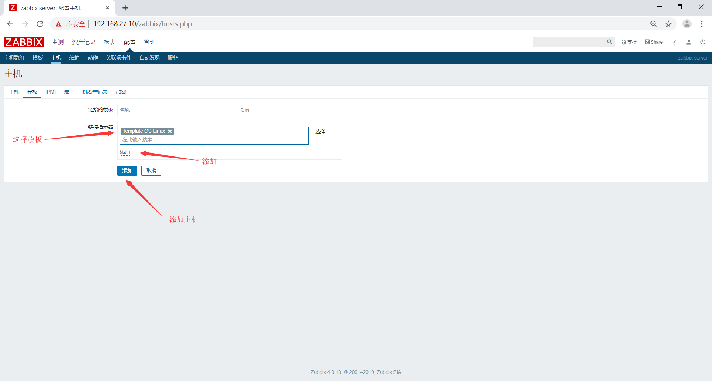