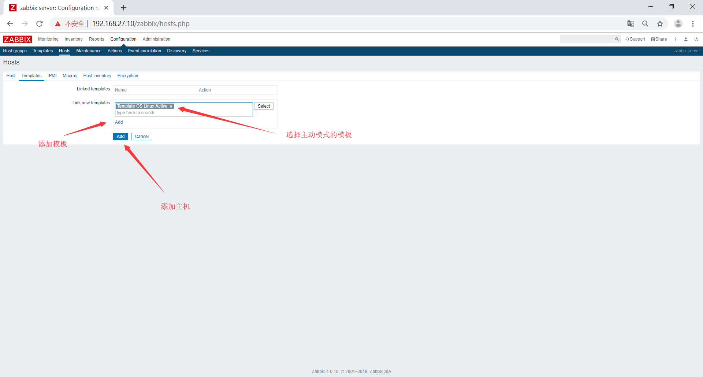

# zabbix-porxy的主动模式
zabbix是一个分布式的监控系统，支持通过代理服务器zabbix proxy收集zabbix agent的数据，然后把收集保存在本地数据库并发送给zabbix server进行统一存储和展示。
## zabbix-proxy和zabbix-server的区别
|功能|zabbix proxy|zabbix server|
|:-|:-|:-|
|轻量级|是|相对重量级|
|图形|无|带图形控制界面|
|可以独立工作|是，可以独立采集数据并存储|是，即数据采集、存储、分析、展 示于一体|
|易维护|是，配置完成后基本无需管理|维护也不难|
|独立数据库|保留少量最近数据|保留指定时间内的所有数据|
|报警通知|否，代理服务器不发送邮件通知|支持邮件、短信等告警机制|

## zabbix-proxy实现
环境准备
|server|IP|os|
|:-|:-|:-|
|zabbix|192.168.27.10|ubuntu 18.04.2|
|proxy|192.168.27.11|ubuntu 18.04.2|
|mysql|192.168.27.12|ubuntu 18.04.2|
## 配置数据库
安装数据库
```bash
root@mysql:~# apt install mariadb-server -y
```
编辑配置文件
```bash
root@mysql:~# vim /etc/mysql/mariadb.conf.d/50-server.cnf 
bind-address            = 192.168.27.12
```
重启服务
```bash
root@mysql:~# systemctl restart mariadb
```
创建数据库并授权
```bash
MariaDB [(none)]> create database zabbix_proxy_active character set utf8 collate utf8_bin;
Query OK, 1 row affected (0.00 sec)

MariaDB [(none)]> grant all privileges on zabbix_proxy_active.* to zabbix_proxy_active@'192.168.27.%' identified by '111111';
Query OK, 0 rows affected (0.00 sec)
```
## 配置zabbix proxy
更新源
```bash
root@proxy:~# wget https://repo.zabbix.com/zabbix/4.0/ubuntu/pool/main/z/zabbix-release/zabbix-release_4.0-2+bionic_all.deb
root@proxy:~# dpkg -i zabbix-release_4.0-2+bionic_all.deb
root@proxy:~# apt update
```
安装zabbix-proxy
```bash
root@proxy:~# apt install zabbix-proxy-mysql -y
```
初始化数据库
```bash
root@proxy:~# zcat /usr/share/doc/zabbix-proxy-mysql/schema.sql.gz | mysql -uzabbix_proxy_active -p111111 -h192.168.27.12 zabbix_proxy_active
```
编辑proxy配置文件
```bash
root@proxy:~# vim /etc/zabbix/zabbix_proxy.conf 
#配置代理的模式0为主动1为被动
ProxyMode=0
#配置zabbix的server端地址
Server=192.168.1.150
#配置Hostname需要和图形端的代理名称相同
Hostname=Zabbix_proxy
#配置监听端口
ListenPort=10051
#配置SourceIp，当存在多块网卡时，指定从哪个地址发送数据
SourceIP=192.168.1.152
#开启远程命令，允许server到proxy上执行命令，在故障自愈时使用
EnableRemoteCommands=1
#数据库地址
DBHost=192.168.1.150
#数据库名
DBName=zabbix_proxy
#配置数据库用户
DBUser=zabbix_proxy
#配置数据库连接密码
DBPassword=123456
#proxy将数据发送给server后将数据在本地保存多少时间
ProxyLocalBuffer=720
#当proxy和server无法连接时将数据在本地保存多长时间，一般为720小时
ProxyOfflineBuffer=720
#用来检测server端和proxy的心跳信息，一般设置为5分钟
HeartbeatFrequency=120
#每间隔多少时间到server获取监控项，防止监控项更新后agent端无法获取到，一般设置为5分钟
ConfigFrequency=600
#数据发送的间隔时间
DataSenderFrequency=60
#开启多少个数据收集器
StartPollers=20
#配置javagateway
JavaGateway=192.168.27.14
#配置javagateway端口
JavaGatewayPort=10052
#启动多少java的数据收集器
StartJavaPollers=10
#当主机数量很多时，会将获取的监控项存放在缓存中，生产中设置2G
CacheSize=128M
#启动多少个线程和数据库连接
StartDBSyncers=10
#保存agent发送过来的监控数据的内存空间大小，生产中设置2G 
HistoryCacheSize=128M
#历史数据的索引
HistoryIndexCacheSize=32M
#获取数据的最长等待时间，30秒
Timeout=30
#配置fping用于探测网络设备
FpingLocation=/usr/bin/fping
#设置启动用户为zabbix
User=zabbix
#配置监听地址
ListenIP=0.0.0.0
```
启动服务，设置为开机启动
```bash
root@proxy:~# systemctl start zabbix-proxy
root@proxy:~# systemctl enable zabbix-proxy
```
## 配置agent端
在MySQL服务上配置agent
```bash
root@mysql:~# wget https://repo.zabbix.com/zabbix/4.0/ubuntu/pool/main/z/zabbix-release/zabbix-release_4.0-2+bionic_all.deb
root@mysql:~# dpkg -i zabbix-release_4.0-2+bionic_all.deb
root@mysql:~# apt update
root@mysql:~# apt install zabbix-agent -y
```
修改配置文件
```bash
root@mysql:~# vim /etc/zabbix/zabbix_agentd.conf 
#配置server分别指向zabbix-server和zabbix-proxy
Server=192.168.27.10,192.168.27.11
#配置ServerActive为proxy地址
ServerActive=192.168.27.11
#配置Hostname为本机地址
Hostname=192.168.27.12
```
启动服务，设置为开机启动
```bash
root@mysql:~# systemctl start zabbix-agent
root@mysql:~# systemctl enable zabbix-agent
```
## 在web上添加代理


## 更改模板的发现规则

分别将以下两个发现规则改为主动


## 更改监控项原型
将发现规则内的所有监控项原型改为主动模式


## 在web上添加主机



