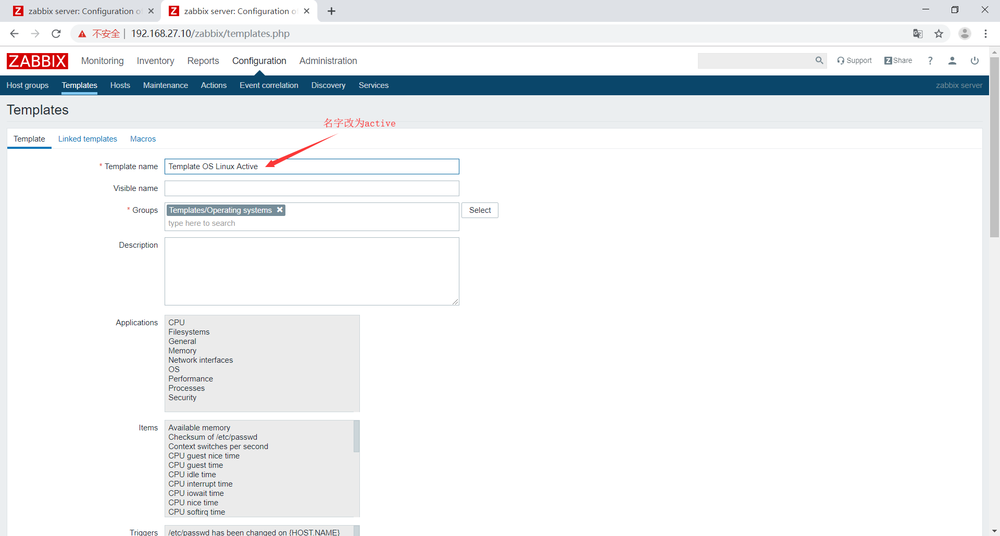
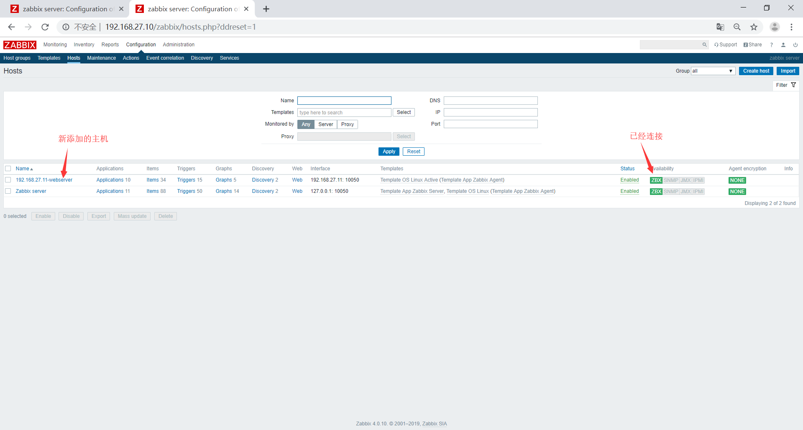

# zabbix主动模式的实现
环境准备
|hostname|os|ip|
|:-|:-|:-|
|zabbix|ubuntu 18.04.2|192.168.27.10|
|agent|ubuntu 18.04.2|192.168.27.11|
***
## 配置agent
修改agent配置文件
```bash
root@agent:~# vim /etc/zabbix/zabbix_agentd.conf
#指定被动模式下的server端，主要再fping做检测时使用
Server=192.168.27.10
#主动模式下的server端地址
ServerActive=192.168.27.10
#hostname填写自己的IP地址，主要是为了和其他主机区分开和从server端获取检测项使用
Hostname=192.168.27.10
```
重启zabbix-agent服务
```bash
root@agent:~# systemctl restart zabbix-agent
```
## 配置zabbix-server
将模板的监控项设置为active模式





## 再server上添加主机


