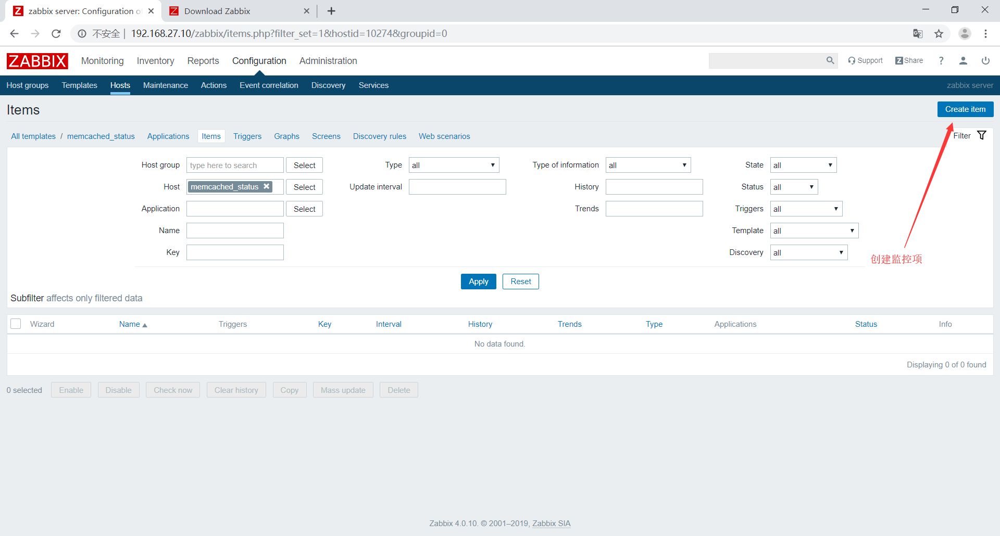

# 配置zabbix监控memcached
## 配置zabbix-agent
安装memcached、nc
```bash
[root@memcached ~]# yum install memcached nc -y
```
启动memcached服务
```bash
 [root@memcached ~]# systemctl start memcached
```
测试能否以非交互模式取出值
```bash
[root@memcached ~]# echo -e "stats\nquit" |nc 127.0.0.1 "11211"
```
## 配置zabbix-agent
安装zabbix-agent
```bash
[root@memcached ~]# rpm -Uvh https://repo.zabbix.com/zabbix/4.0/rhel/7/x86_64/zabbix-release-4.0-1.el7.noarch.rpm
[root@memcached ~]# yum install zabbix-agent -y
```
编写监控脚本
```bash
[root@memcached ~]# vim /etc/zabbix/zabbix_agentd.d/memcached.sh
#!/bin/bash
memcached_status(){
        M_PORT=$1
        M_COMMAND=$2
        echo -e  "stats\nquit" | nc  127.0.0.1 "$M_PORT" | grep "STAT $M_COMMAND" | awk '{print $3}'
}
main(){
    case $1 in
        memcached_status)
            memcached_status $2 $3
                ;;
    esac
}

main $1 $2 $3

```
测试脚本
```bash
[root@memcached ~]# bash /etc/zabbix/zabbix_agentd.d/memcached.sh memcached_status 11211 uptime
4148
```
脚本添加执行权限
```bash
[root@memcached ~]# chmod +x /etc/zabbix/zabbix_agentd.d/memcached.sh 
```
编辑agent配置文件
```bash
[root@memcached ~]# vim /etc/zabbix/zabbix_agentd.conf 
#将server指向zabbix-server和zabbix-proxy
Server=192.168.27.10,192.168.27.11
#主动模式下的server指向proxy
ServerActive=192.168.27.11
#配置hostname为本地IP
Hostname=192.168.27.20
#导入配置文件
Include=/etc/zabbix/zabbix_agentd.d/*.conf
#添加监控项
UserParameter=memcached_status[*],/etc/zabbix/zabbix_agentd.d/memcached.sh $1 $2 $3
```
重启服务
```bash
[root@memcached ~]# systemctl restart zabbix-agent
```
在server端测试能否获取数据
```bash
root@zabbix:~# zabbix_get -s 192.168.27.20 -p 10050 -k "memcached_status[memcached_status,11211,uptime]"
4952
```
## 在web上创建模板
按照以下方法分别创建出curr_connections、memcached_threads两个监控项





## 将模板关联到主机


