# zabbix的邮件通知及自愈
## 配置nginx
开启nginx配置
```bash
        location /nginx_status {
                stub_status;
                allow 127.0.0.1;
                deny all;
        }
```
启动nginx，测试访问状态页
```bash
[root@localhost ~]# nginx
[root@localhost ~]# curl 127.0.0.1/nginx_status
Active connections: 1 
server accepts handled requests
 1 1 1 
Reading: 0 Writing: 1 Waiting: 0 
```
## 配置zabbix-agent
安装agent
```bash
[root@localhost ~]#  rpm -Uvh https://repo.zabbix.com/zabbix/4.0/rhel/7/x86_64/zabbix-release-4.0-1.el7.noarch.rpm
[root@localhost ~]# yum install zabbix-agent -y
```
编写监控脚本
```bash
[root@localhost ~]# vim /etc/zabbix/zabbix_agentd.d/nginx_status.sh
#!/bin/bash 

nginx_status_fun(){ #函数内容
	NGINX_PORT=$1 #端口，函数的第一个参数是脚本的第二个参数，即脚本的第二个参数是段端口号
	NGINX_COMMAND=$2 #命令，函数的第二个参数是脚本的第三个参数，即脚本的第三个参数是命令
	nginx_active(){ #获取nginx_active数量，以下相同，这是开启了nginx状态但是只能从本机看到
        /usr/bin/curl "http://127.0.0.1:"$NGINX_PORT"/nginx_status/" 2>/dev/null| grep 'Active' | awk '{print $NF}'
        }
	nginx_reading(){ #获取nginx_reading状态的数量
        /usr/bin/curl "http://127.0.0.1:"$NGINX_PORT"/nginx_status/" 2>/dev/null| grep 'Reading' | awk '{print $2}'
       }
	nginx_writing(){
        /usr/bin/curl "http://127.0.0.1:"$NGINX_PORT"/nginx_status/" 2>/dev/null| grep 'Writing' | awk '{print $4}'
       }
	nginx_waiting(){
        /usr/bin/curl "http://127.0.0.1:"$NGINX_PORT"/nginx_status/" 2>/dev/null| grep 'Waiting' | awk '{print $6}'
       }
	nginx_accepts(){
        /usr/bin/curl "http://127.0.0.1:"$NGINX_PORT"/nginx_status/" 2>/dev/null| awk NR==3 | awk '{print $1}'
       }
	nginx_handled(){
        /usr/bin/curl "http://127.0.0.1:"$NGINX_PORT"/nginx_status/" 2>/dev/null| awk NR==3 | awk '{print $2}'
       }
	nginx_requests(){
        /usr/bin/curl "http://127.0.0.1:"$NGINX_PORT"/nginx_status/" 2>/dev/null| awk NR==3 | awk '{print $3}'
       }
  	case $NGINX_COMMAND in
		active)
			nginx_active;
			;;
		reading)
			nginx_reading;
			;;
		writing)
			nginx_writing;
			;;
		waiting)
			nginx_waiting;
			;;
		accepts)
			nginx_accepts;
			;;
		handled)
			nginx_handled;
			;;
		requests)
			nginx_requests;
		esac 
}

main(){ #主函数内容
	case $1 in #分支结构，用于判断用户的输入而进行响应的操作
		nginx_status) #当输入nginx_status就调用nginx_status_fun，并传递第二和第三个参数
			nginx_status_fun $2 $3;
			;;
		*) #其他的输入打印帮助信息
			echo $"Usage: $0 {nginx_status key}"
	esac #分支结束符
}

main $1 $2 $3
```
测试脚本
```bash
[root@localhost ~]# bash /etc/zabbix/zabbix_agentd.d/nginx_status.sh nginx_status 80 active
1
```
给脚本添加执行权限
```bash
[root@localhost ~]# chmod +x /etc/zabbix/zabbix_agentd.d/nginx_status.sh
```
修改agent配置文件
```bash
[root@localhost ~]# vim /etc/zabbix/zabbix_agentd.conf 
Server=192.168.27.10,192.168.27.11
ServerActive=192.168.27.11
Hostname=192.168.27.20
Timeout=30
UserParameter=nginx_status[*],/etc/zabbix/zabbix_agentd.d/nginx_status.sh $1 $2 $3
```
重启服务
```bash
[root@localhost ~]# systemctl restart zabbix-agent.service 
```
在zabbix-server端测试
```bash
root@zabbix:~# zabbix_get  -s 192.168.27.20 -p 10050 -k "nginx_status[nginx_status 80 active]"
1
```
## 导入nginx模板
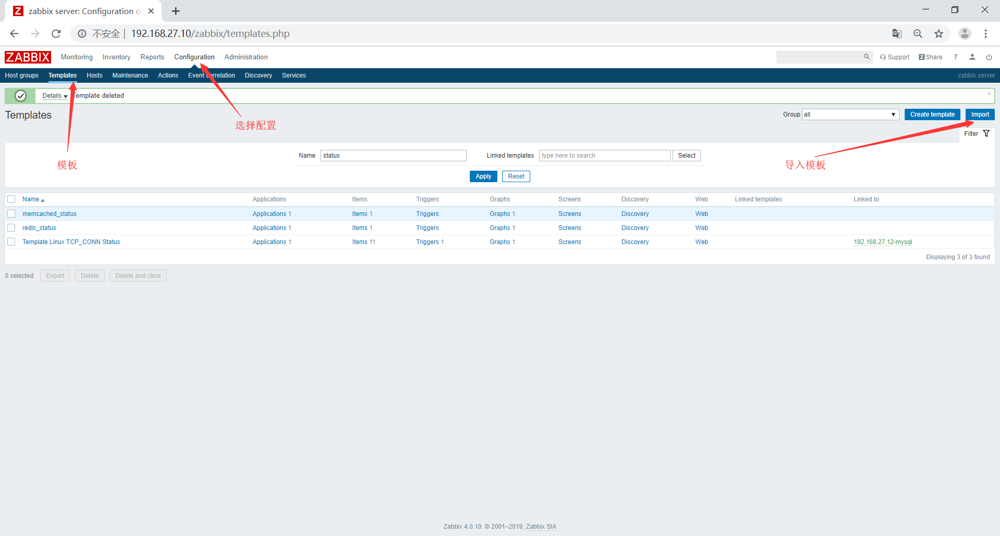
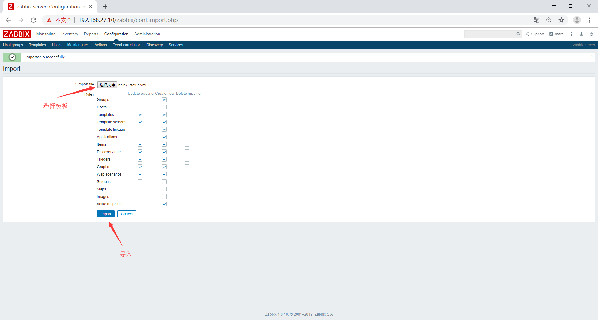
## 将模板关联主机
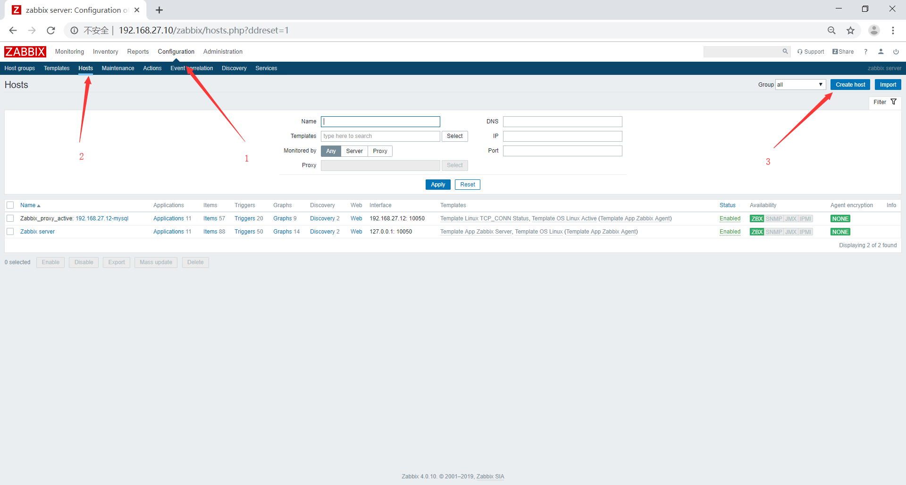
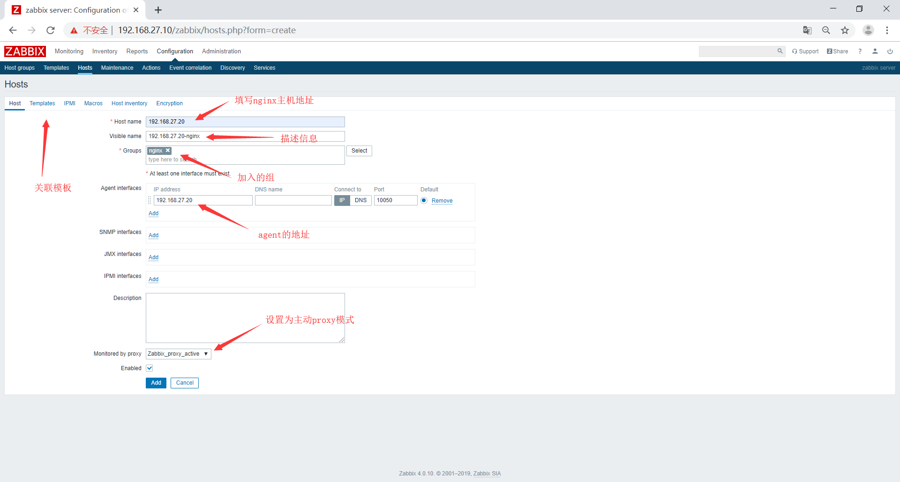
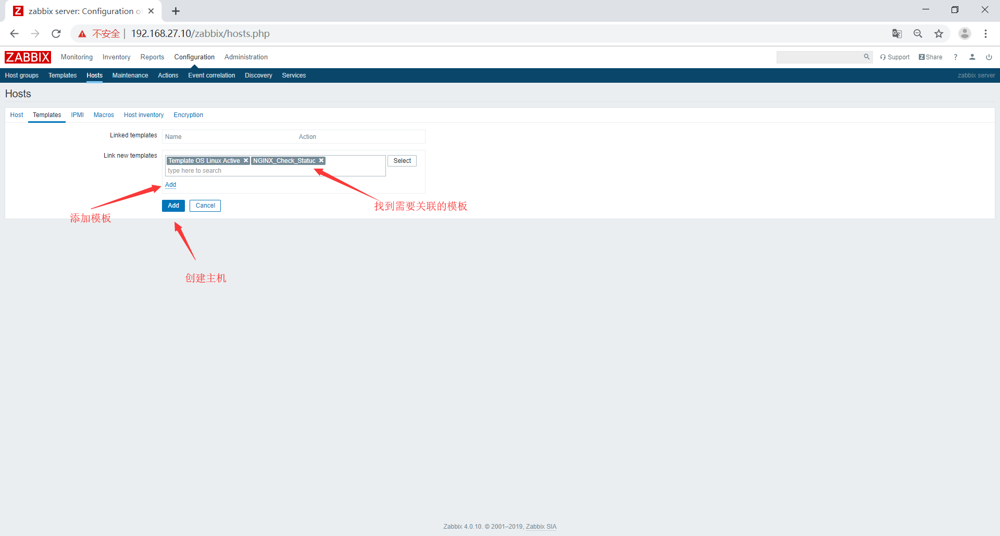
## 配置邮件通知
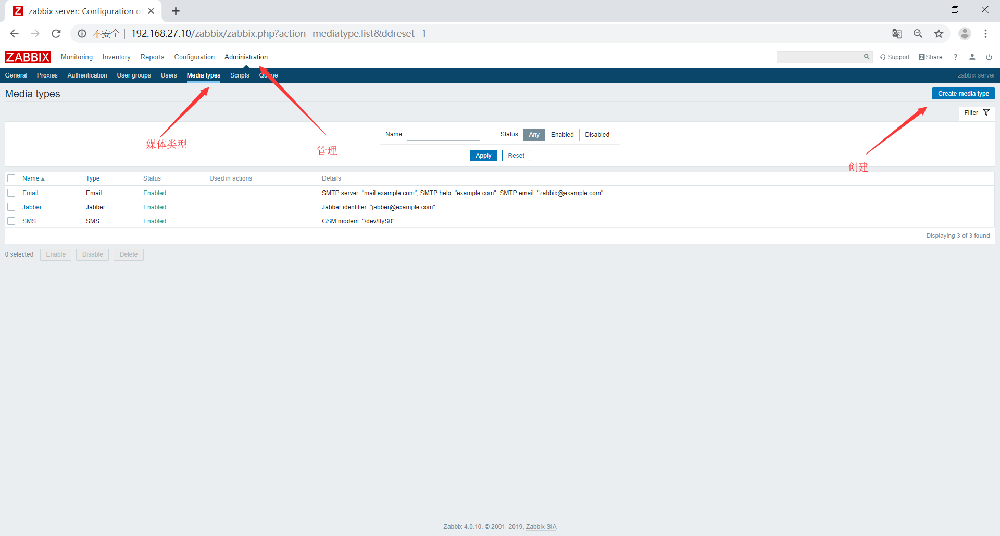
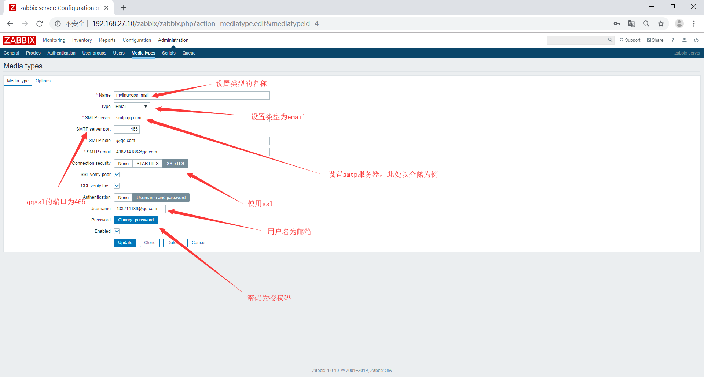
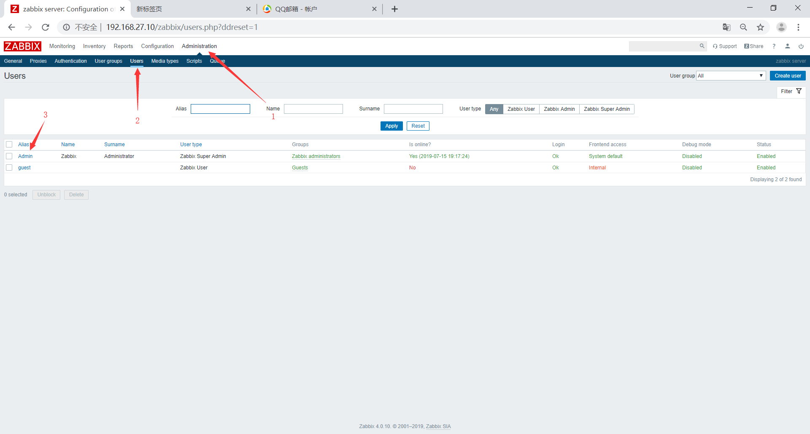
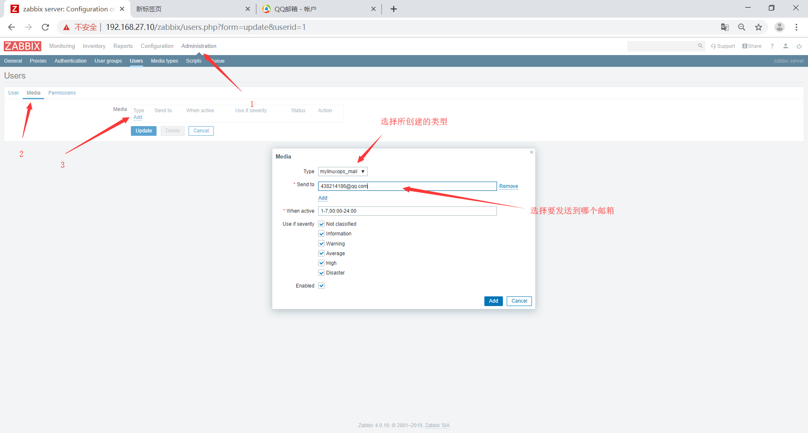
## 配置action
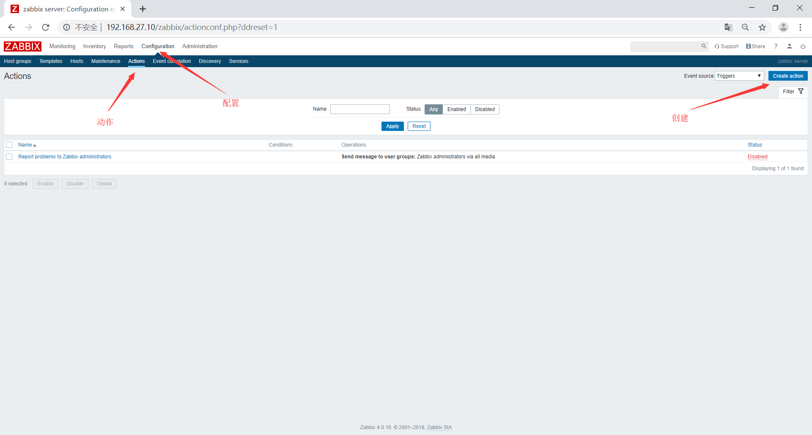
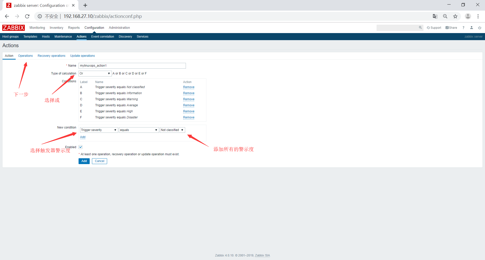
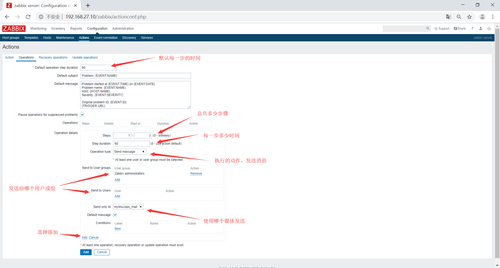
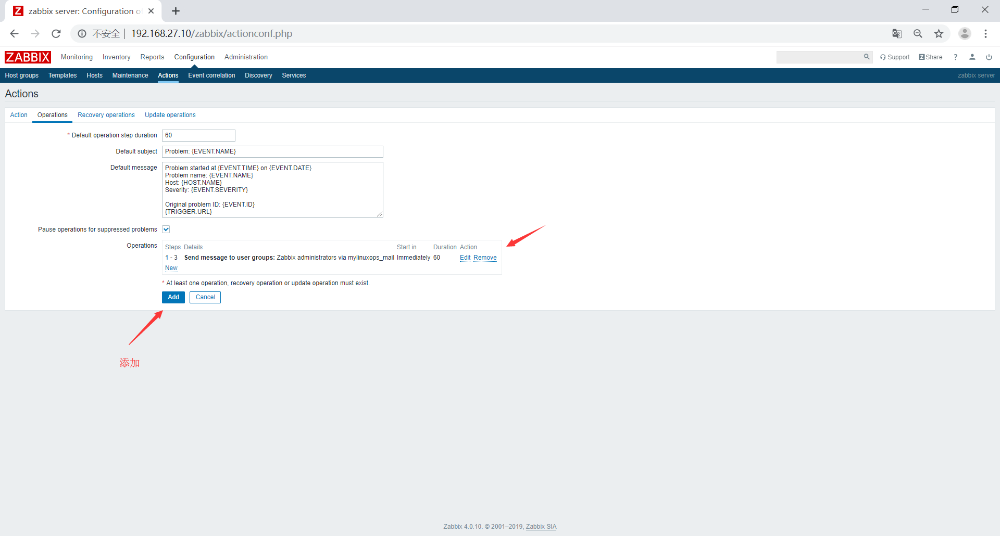
将nginx停止后测试

## 配置恢复时通知
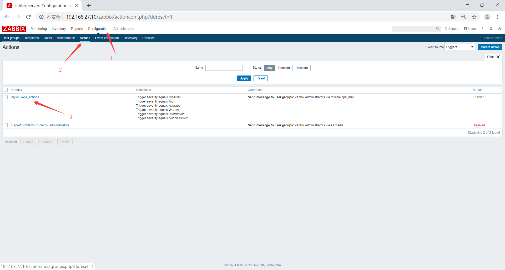
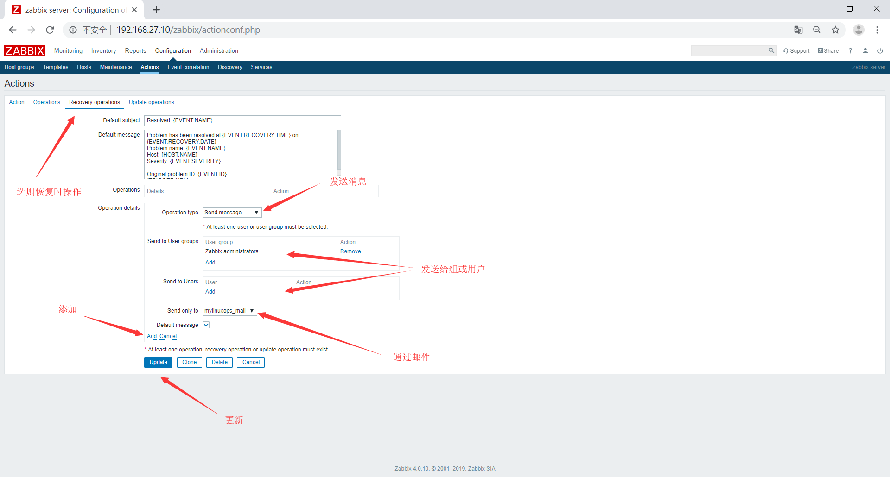
启动nginx测试

## 配置自治愈
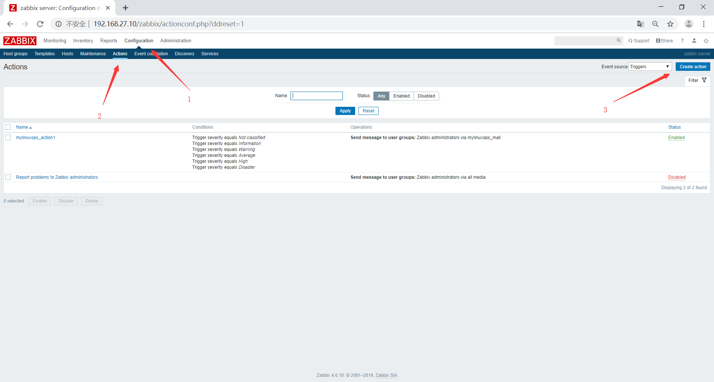
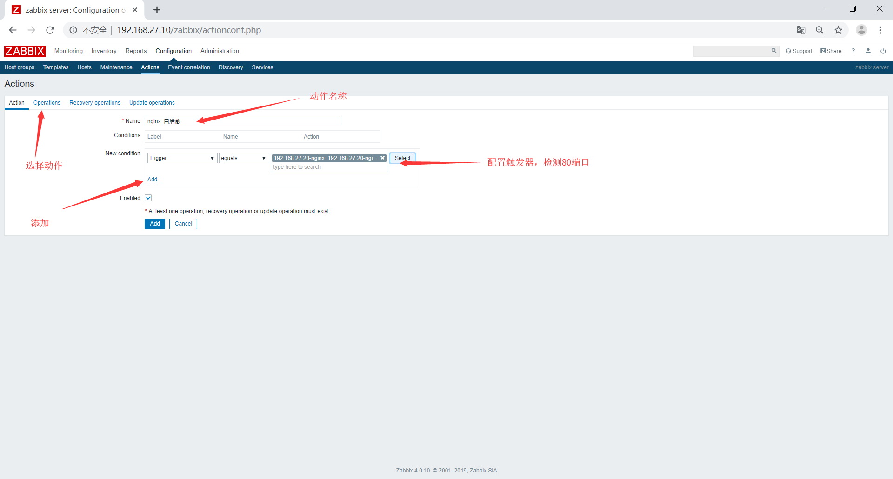
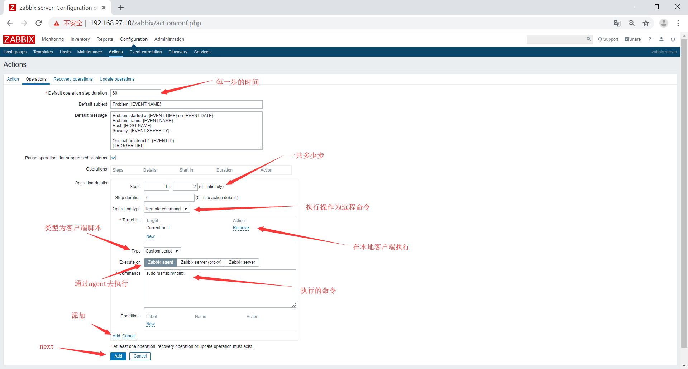
修改agent端的配置文件
```bash
#开启远程命令
EnableRemoteCommands=1
#开启特殊字符的使用
UnsafeUserParameters=1
```
重启agent服务
```bash
[root@localhost ~]# systemctl restart zabbix-agent
```
修改sudo权限，让zabbix用户无需密码就能执行管理命令
```bash
[root@localhost ~]# vim /etc/sudoers
zabbix  ALL=(ALL)       NOPASSWD: ALL
```
测试停止nginx服务
```bash
[root@localhost ~]# nginx -s stop
[root@localhost ~]# ss -tnl | grep 80
```
1分钟后服务自动启动
```bash
[root@localhost ~]# ss -tnl | grep 80
LISTEN     0      511          *:80                       *:*                  
LISTEN     0      511         :::80                      :::*  
```
