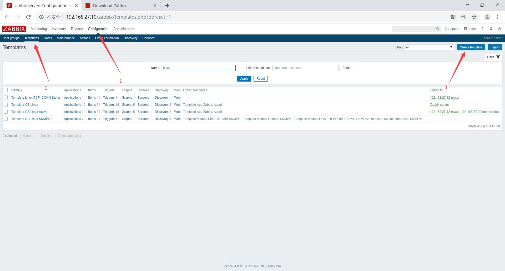

# zabbix监控redis
## 配置redis
安装redis
```bash
[root@localhost ~]# yum install redis -y
```
修改配置文件
```bash
[root@localhost ~]# vim /etc/redis.conf 
bind 0.0.0.0
```
启动服务
```bash
[root@localhost ~]# systemctl start redis
```
测试redis取值
```bash
[root@localhost ~]# echo -e "info\n quit" |nc 127.0.0.1 "6379"
```
# 配置zabbix-agent
安装zabbix-agent
```bash
[root@localhost ~]# rpm -Uvh https://repo.zabbix.com/zabbix/4.0/rhel/7/x86_64/zabbix-release-4.0-1.el7.noarch.rpm
[root@localhost ~]# yum -y install zabbix-agent
```
编写监控脚本
```bash
[root@localhost ~]# vim /etc/zabbix/zabbix_agentd.d/redis_status.sh
#!/bin/bash
redis_status(){
        R_PORT=$1
        R_COMMAND=$2
        (echo -en "INFO \r\n";sleep 1;) | nc 127.0.0.1 "$R_PORT" > /tmp/redis_"$R_PORT".tmp
        REDIS_STAT_VALUE=$(grep ""$R_COMMAND":" /tmp/redis_"$R_PORT".tmp | cut -d ':' -f2)
        echo $REDIS_STAT_VALUE  
}

help(){
        echo "${0} + redis_status + PORT + COMMAND"
}

main(){
    case $1 in
        redis_status)
            redis_status $2 $3
                ;;
        *)
            help
                ;;
        esac
}
main $1 $2 $3
```
测试脚本
```bash
[root@localhost ~]# bash /etc/zabbix/zabbix_agentd.d/redis_status.sh redis_status 6379 used_cpu_sys
1.04
```
给脚本添加执行权限
```bash
[root@localhost ~]# chmod +x /etc/zabbix/zabbix_agentd.d/redis_status.sh
```
将生成的临时文件删除
```bash
[root@localhost ~]# rm -rf /tmp/redis_6379.tmp 
```
修改配置文件
```bash
[root@localhost ~]# vim /etc/zabbix/zabbix_agentd.conf 
Server=192.168.27.10,192.168.27.11
ServerActive=192.168.27.11
Hostname=192.168.27.20
Timeout=30
UserParameter=redis_status[*],/etc/zabbix/zabbix_agentd.d/redis_status.sh $1 $2 $3
```
重启服务
```bash
[root@localhost ~]# systemctl restart zabbix-agent.service 
```
在zabbix-server上测试能否取值
```bash
root@zabbix:~# zabbix_get  -s 192.168.27.20 -p 10050 -k "redis_status[redis_status 6379 used_cpu_sys]"
1.46
```
## 在server上添加模板



## 将模板关联到主机


