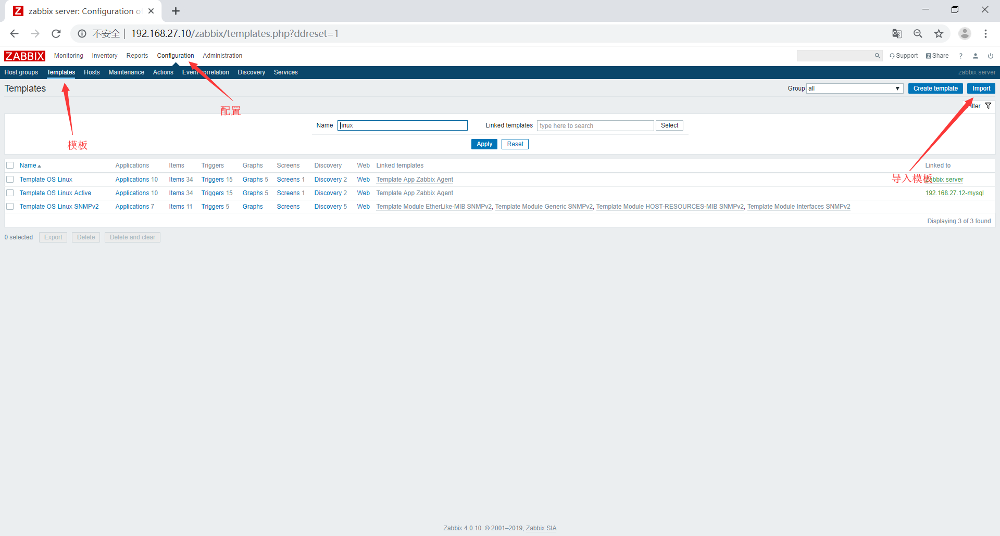
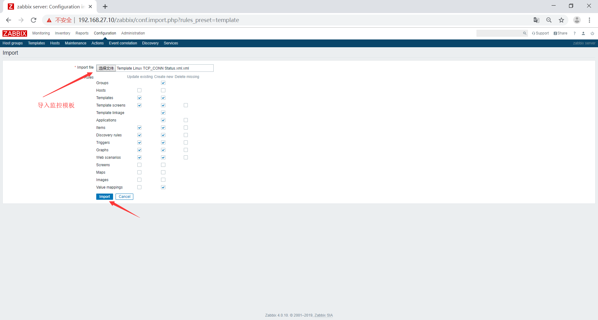
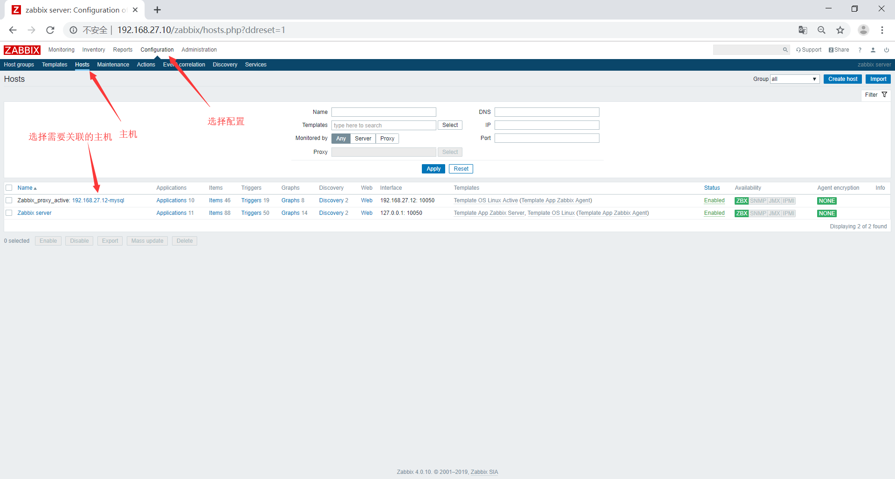
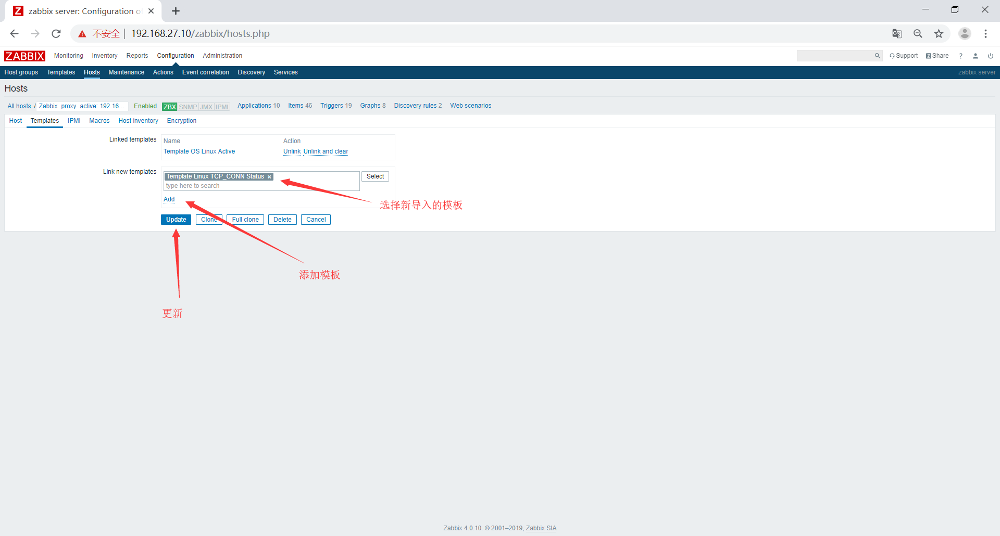
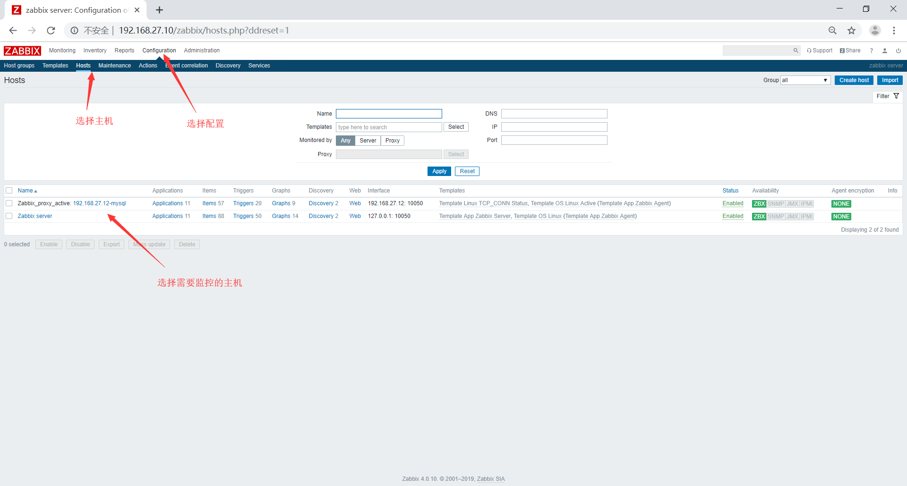
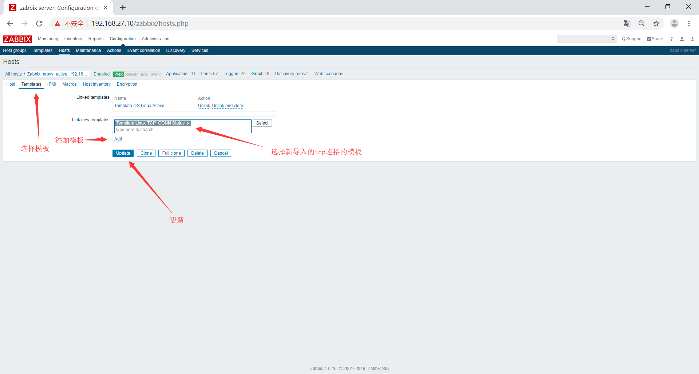
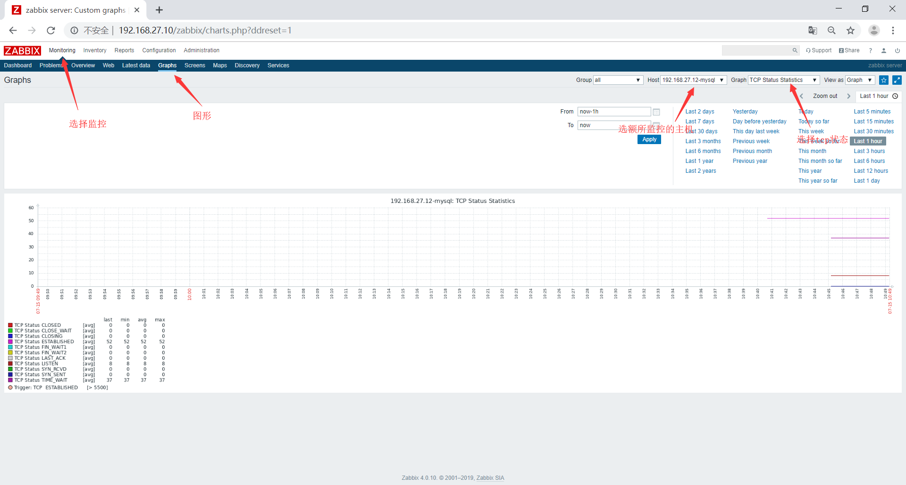

# zabbix监控tcp连接数
zabbix监控tcp连接数的方法如下
## agent端配置
在/etc/zabbix/zabbix_agentd.conf编写脚本
```bash
root@mylinuxops:~# vim /etc/zabbix/zabbix_agentd.d/tcp_conn.sh
#!/bin/bash
tcp_conn_status(){
        TCP_STAT=$1
        ss -ant | awk 'NR>1 {++s[$1]} END {for(k in s) print k,s[k]}' > /tmp/tcp_conn.txt
        TCP_STAT_VALUE=$(grep "$TCP_STAT" /tmp/tcp_conn.txt | cut -d ' ' -f2)
        if [ -z $TCP_STAT_VALUE ];then
                TCP_STAT_VALUE=0
        fi
        echo $TCP_STAT_VALUE
}

main(){
	case $1 in
	    tcp_status)
		tcp_conn_status $2;	
		;;
		*)
		echo "$0 + tcp_status + STATUS"
	esac
}

main $1 $2
```
修改脚本的执行权限
```bash
root@mylinuxops:~# chmod +x /etc/zabbix/zabbix_agentd.d/tcp_conn.sh 
```
修改agent配置文件
```bash
root@mylinuxops:~# vim /etc/zabbix/zabbix_agentd.conf 
#指向server端和proxy端
Server=192.168.27.10,192.168.27.11
#使用主动模式
ServerActive=192.168.27.11
#Hostname为本机IP
Hostname=192.168.27.12
#将/etc/zabbix/zabbix_agentd.d/下所有的.conf文件导入配置
Include=/etc/zabbix/zabbix_agentd.d/*.conf
#将脚本传递的参数和监控项写入配置文件
UserParameter=linux_status[*],/etc/zabbix/zabbix_agentd.d/tcp_conn.sh $1 $2
```
重启agent服务
```bash
root@mylinuxops:~# systemctl restart zabbix-agent
```
在zabbix-server端测试能否获取数据
```bash
root@zabbix:~# zabbix_get -s 192.168.27.12 -p 10050 -k "linux_status[tcp_status,TIME-WAIT]"
37
#可以获取到数据
```
## 在zabbix的web界面上导入模板




## 将模板关联到主机


## 验证数据已经收集
