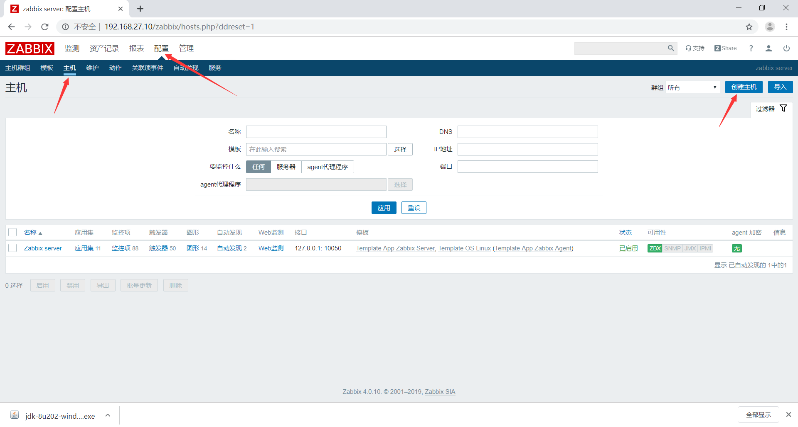
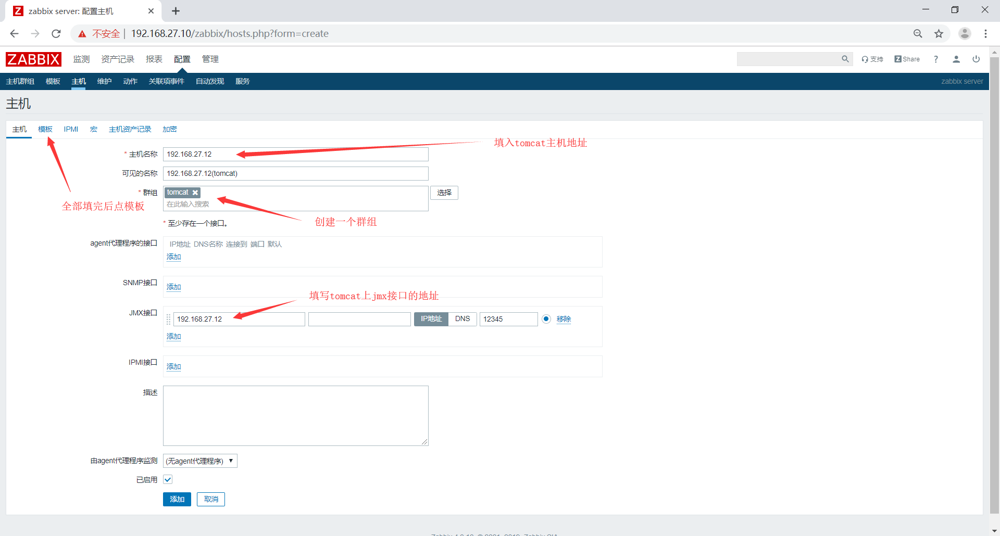
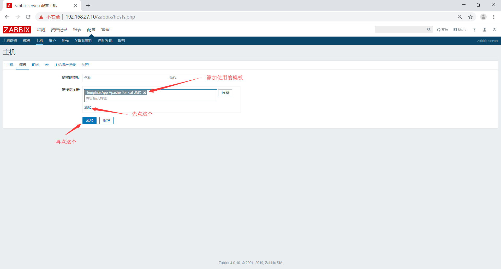
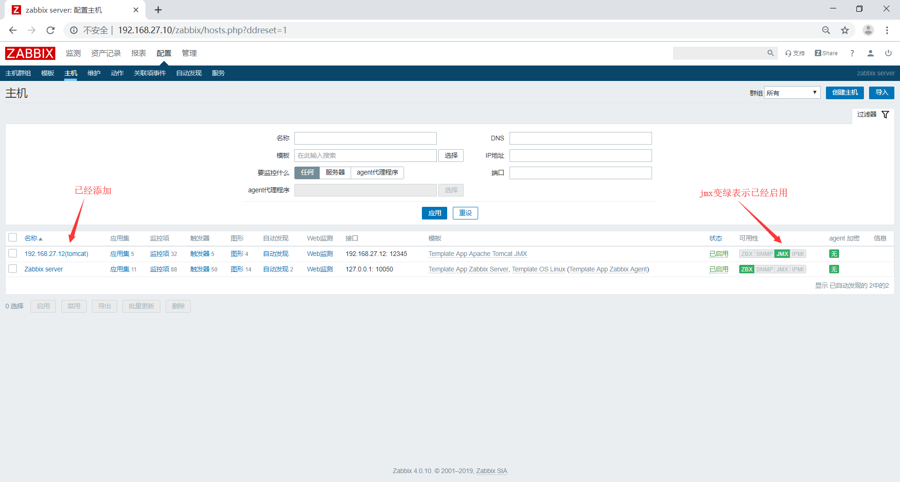

# zabbix监控Tomcat
zabbix要监控tomcat需要一个中转站java gateway，需要由Java gateway转发给java app,在java app上采集导数据再转发给java gateway，Java gateway再发回给zabbix-server，Java app使用的端口为12345使用的通信协议为jmx
## zabbix监控Tomcat实现
环境准备
|Server|IP|hostname|
|:-|:-|:-|
|zabbix|192.168.27.10|zabbix|
|Java-Gateway|192.168.27.11|gateway|
|tomcat|192.168.27.12|tomcat|
## 配置tomcat
安装jdk
```bash
root@tomcat:~# apt install openjdk-8-jdk
```
测试
```bash
root@tomcat:~# java -version
openjdk version "1.8.0_212"
OpenJDK Runtime Environment (build 1.8.0_212-8u212-b03-0ubuntu1.18.04.1-b03)
OpenJDK 64-Bit Server VM (build 25.212-b03, mixed mode)
```
安装tomcat
```bash
root@tomcat:~# tar xf apache-tomcat-8.5.42.tar.gz -C /usr/local/src/
root@tomcat:~# ln -sv /usr/local/src/apache-tomcat-8.5.42 /usr/local/tomcat
```
添加PATH环境
```bash
root@tomcat:~# vim /etc/profile.d/tomcat.sh
#!/bin/bash
export CATALINA_HOME=/usr/local/tomcat
export PATH=$CATALINA_HOME/bin:$PATH
```
创建测试首页
```bash
root@tomcat:~# mkdir /usr/local/tomcat/webapps/mylinuxops
root@tomcat:~# echo "welcome to mylinuxops.com" > /usr/local/tomcat/webapps/mylinuxops/index.html
```
修改tomcat启动脚本
```bash
root@tomcat:~# vim /usr/local/tomcat/bin/catalina.sh 
CATALINA_OPTS="$CATALINA_OPTS 
-Dcom.sun.management.jmxremote       #启动远程监控jmx
-Dcom.sun.management.jmxremote.port=12345      #默认启动的jxm端口号，要和zabbix添加主机时候的端口一致 -Dcom.sun.management.jmxremote.authenticate=false     #不使用用户名密码
-Dcom.sun.management.jmxremote.ssl=false        #不适用ssl认证
-Djava.rmi.server.hostname=192.168.27.12"       #tomcat主机自己的IP地址
```
启动tomcat启动脚本
```bash
root@tomcat:~# catalina.sh start
Using CATALINA_BASE:   /usr/local/tomcat
Using CATALINA_HOME:   /usr/local/tomcat
Using CATALINA_TMPDIR: /usr/local/tomcat/temp
Using JRE_HOME:        /usr
Using CLASSPATH:       /usr/local/tomcat/bin/bootstrap.jar:/usr/local/tomcat/bin/tomcat-juli.jar
Tomcat started.
```
查看端口确认12345端口已经启动
```bash
root@tomcat:~# ss -tnl
State     Recv-Q     Send-Q               Local Address:Port          Peer Address:Port     
LISTEN    0          128                  127.0.0.53%lo:53                 0.0.0.0:*        
LISTEN    0          128                        0.0.0.0:22                 0.0.0.0:*        
LISTEN    0          128                      127.0.0.1:6010               0.0.0.0:*        
LISTEN    0          50                               *:36910                    *:*        
LISTEN    0          100                              *:8080                     *:*        
LISTEN    0          128                           [::]:22                    [::]:*        
LISTEN    0          50                               *:12345                    *:*        
LISTEN    0          128                          [::1]:6010                  [::]:*        
LISTEN    0          1               [::ffff:127.0.0.1]:8005                     *:*        
LISTEN    0          100                              *:8009                     *:*        
LISTEN    0          50                               *:35274                    *:*   
```
## 配置Java gateway
下载zabbix源
```bash
root@gateway:~# wget https://repo.zabbix.com/zabbix/4.0/ubuntu/pool/main/z/zabbix-release/zabbix-release_4.0-2+bionic_all.deb
root@gateway:~# dpkg -i zabbix-release_4.0-2+bionic_all.deb
root@gateway:~# apt update 
```
在gateway主机上安装zabbix-java-gateway
```bash
root@gateway:~# apt install zabbix-java-gateway -y
```
修改配置文件
```bash
root@gateway:~# grep -v "^$" /etc/zabbix/zabbix_java_gateway.conf | grep -v "#"
LISTEN_IP="0.0.0.0"
LISTEN_PORT=10052
PID_FILE="/var/run/zabbix/zabbix_java_gateway.pid"
START_POLLERS=10     #启动多少个进程轮训java，要和java 应用保持一定关系
TIMEOUT=30      #超时时间设置为30秒，
```
重启zabbix-java-gateway服务
```bash
root@gateway:~# systemctl restart zabbix-java-gateway
```
## 配置zabbix server
修改zabbix server配置文件
```bash
root@zabbix:~# vim /etc/zabbix/zabbix_server.conf 
### Option: JavaGateway
#       IP address (or hostname) of Zabbix Java gateway.
#       Only required if Java pollers are started.
#
# Mandatory: no
# Default:
# JavaGateway=
JavaGateway=192.168.27.11        #指定java gateway的地址

### Option: JavaGatewayPort
#       Port that Zabbix Java gateway listens on.
#
# Mandatory: no
# Range: 1024-32767
# Default:
JavaGatewayPort=10052        #指定java gateway的服务器监听端口，如果是默认端口可以不写 

### Option: StartJavaPollers
#       Number of pre-forked instances of Java pollers.
#
# Mandatory: no
# Range: 0-1000
# Default:
StartJavaPollers=10         #启动多少个进程去轮训 java gateway，要和java gateway的配置一致
```
在web界面上添加主机




