# 编译安装zabbix
环境部署
|hostname|IP|OS|
|:-|:-|:-|
|zabbix|192.168.26.10|ubuntu 18.04.2|
|mysql|192.168.27.11|ubuntu 18.04.2|
|appserver|192.168.27.12|ubuntu 18.04.2|
***
## 配置数据库
安装数据库
```bash
root@appserver:~# apt install mariadb-server -y
```
修改数据库监听地址
```bash
root@mysql:~# vim /etc/mysql/mariadb.conf.d/50-server.cnf 
bind-address            = 192.168.27.11
```
重启服务
```bash
root@mysql:~# systemctl restart mariadb
```
创建数据库并授权
```bash
MariaDB [(none)]> create database zabbix character set utf8 collate utf8_bin;
MariaDB [(none)]> grant all privileges on zabbix.* to zabbix@'192.168.27.%' identified by '123456';
```
## 部署zabbix-server
安装编译环境所需要的软件
```bash
root@zabbix:~# apt-get install apache2 apache2-bin apache2-data apache2-utils fontconfig-config fonts-dejavu-core fping libapache2-mod-php   libapache2-mod-php7.2 libapr1 libaprutil1 libaprutil1-dbd-sqlite3 libaprutil1-ldap libfontconfig1 libgd3 libiksemel3 libjbig0 libjpeg-turbo8 libjpeg8 liblua5.2-0 libodbc1 libopenipmi0 libsensors4 libsnmp-base libsnmp30 libsodium23 libssh2-1 libtiff5 libwebp6 libxpm4 php-bcmath php-common php-gd php-ldap php-mbstring php-mysql php-xml php7.2-bcmath php7.2-cli  php7.2-common php7.2-gd php7.2-json php7.2-ldap php7.2-mbstring php7.2-mysql php7.2-opcache php7.2-readline php7.2-xml snmpd  ssl-cert ttf-dejavu-core libmysqlclient-dev libxml2-dev libxml2 snmp libsnmp-dev libevent-dev openjdk-8-jdk curl libcurl4-openssl-dev 
```
下载源码包
```bash
root@zabbix:~# wget https://sourceforge.net/projects/zabbix/files/ZABBIX%20Latest%20Stable/4.0.10/zabbix-4.0.10.tar.gz
```
创建zabbix用户
```bash
root@zabbix:~# useradd zabbix
```
解压源码包
```bash
root@zabbix:~# tar xf zabbix-4.0.10.tar.gz -C /usr/local/src/
```
检查安装环境
```bash
root@zabbix:~# cd /usr/local/src/zabbix-4.0.10
root@zabbix:/usr/local/src/zabbix-4.0.10# ./configure --prefix=/apps/zabbix_server  --enable-server --enable-agent --with-mysql  --with-net-snmp --with-libcurl --with-libxml2  --enable-java
```
编译安装
```bash
root@zabbix:/usr/local/src/zabbix-4.0.10# make && make install
```
初始化数据库
```bash
root@zabbix:/usr/local/src/zabbix-4.0.10# cd database/mysql/
root@zabbix:/usr/local/src/zabbix-4.0.10/database/mysql# mysql -uzabbix -p123456 -h192.168.27.11 zabbix < schema.sql 
root@zabbix:/usr/local/src/zabbix-4.0.10/database/mysql# mysql -uzabbix -p123456 -h192.168.27.11 zabbix < images.sql 
root@zabbix:/usr/local/src/zabbix-4.0.10/database/mysql# mysql -uzabbix -p123456 -h192.168.27.11 zabbix < data.sql 
```
编辑zabbix_server配置文件，配置数据库连接
```bash
root@zabbix:~# vim /apps/zabbix_server/etc/zabbix_server.conf
DBHost=192.168.27.11
DBPassword=123456
```
修改权限
```bash
root@zabbix:~# chown -R zabbix.zabbix /apps/zabbix_server
```
启动服务
```bash
root@zabbix:~# /apps/zabbix_server/sbin/zabbix_server -c /apps/zabbix_server/etc/zabbix_server.conf
```
配置前端web
```bash
root@zabbix:~# cp -a /usr/local/src/zabbix-4.0.10/frontends/php /var/www/html/zabbix
```
使用浏览器访问
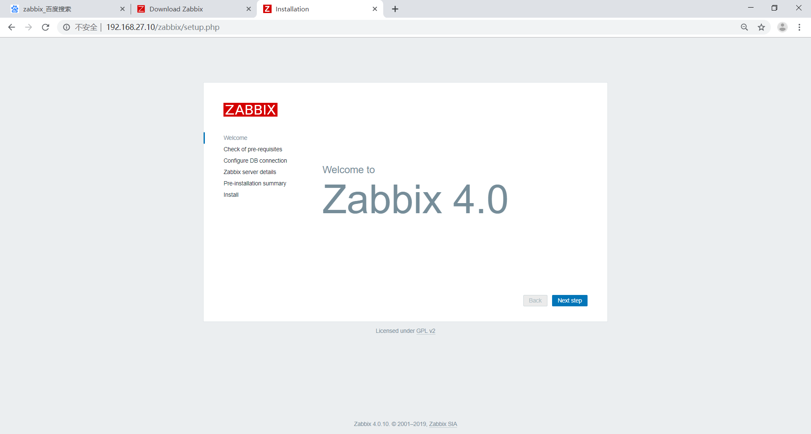
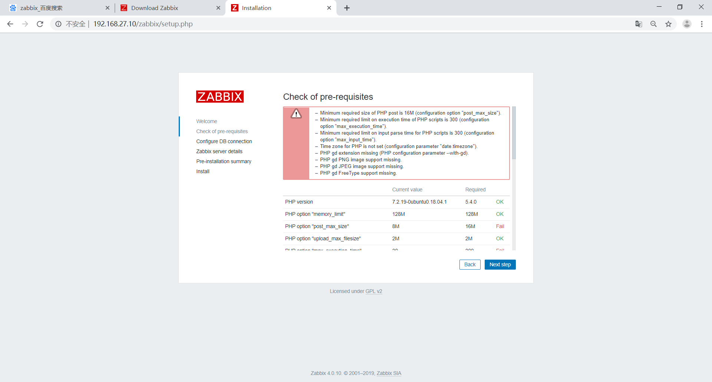
需要解决各种依赖关系
```bash
root@zabbix:~# vim /etc/php/7.2/apache2/php.ini 
post_max_size = 16M
max_execution_time = 300
max_input_time = 300
date.timezone = Asia/Shanghai
```
重启apache
```bash
root@zabbix:~# systemctl restart apahce2
```
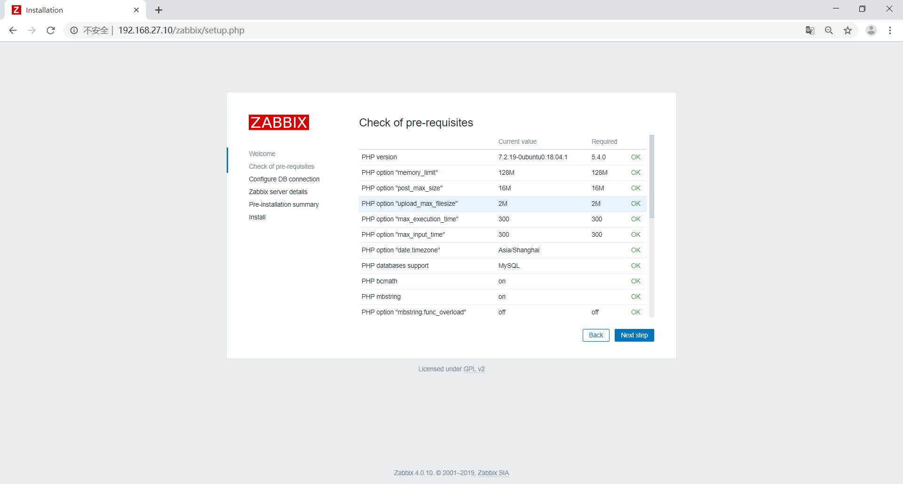
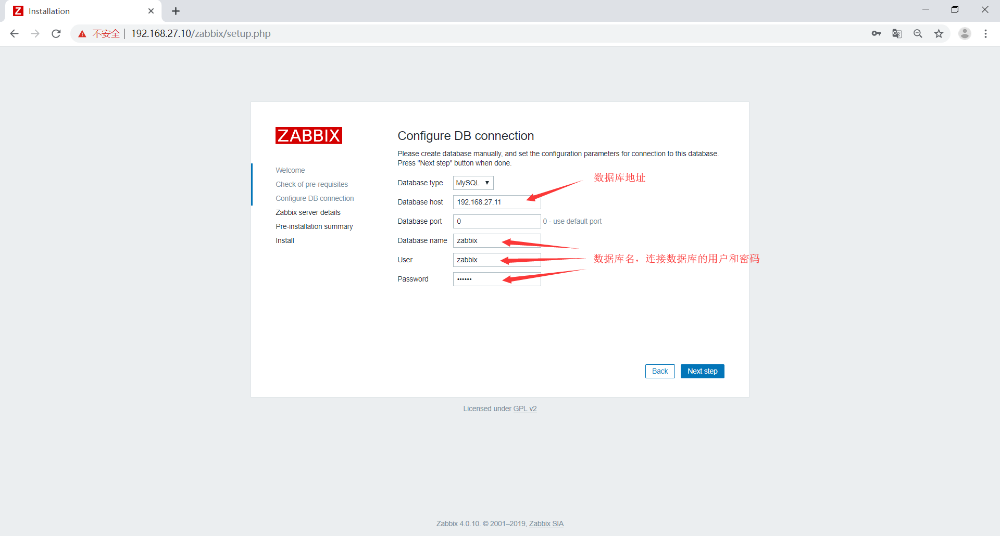
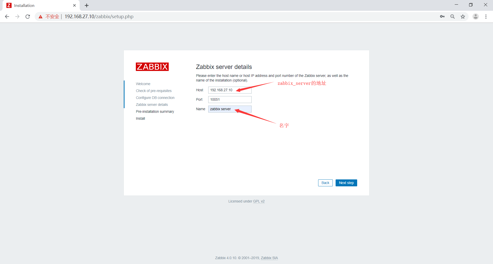
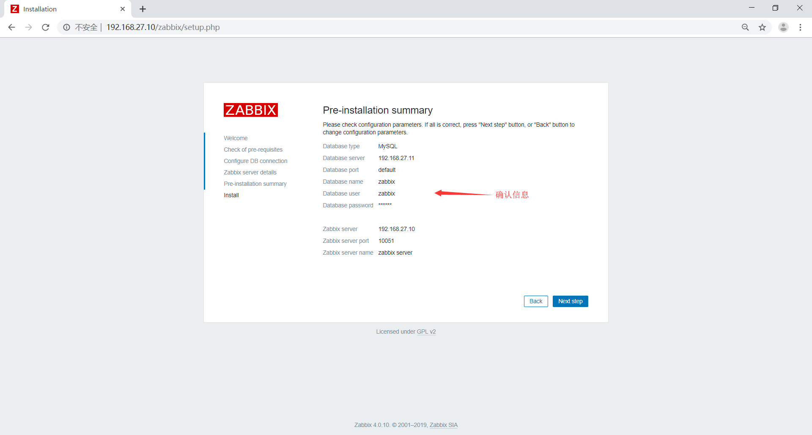

上传zabbix.conf.php
```bash
root@zabbix:/var/www/html/zabbix/conf# ll
total 24
drwxr-xr-x  2 zabbix zabbix 4096 Jul 13 06:50 ./
drwxr-xr-x 10 zabbix zabbix 4096 Jun 26 11:20 ../
-rw-r--r--  1 zabbix zabbix  163 Jun 26 11:20 .htaccess
-rw-r--r--  1 zabbix zabbix 1036 Jun 26 11:20 maintenance.inc.php
-rw-r--r--  1 root   root    436 Jul 13 06:49 zabbix.conf.php
-rw-r--r--  1 zabbix zabbix  741 Jun 26 11:20 zabbix.conf.php.example
```
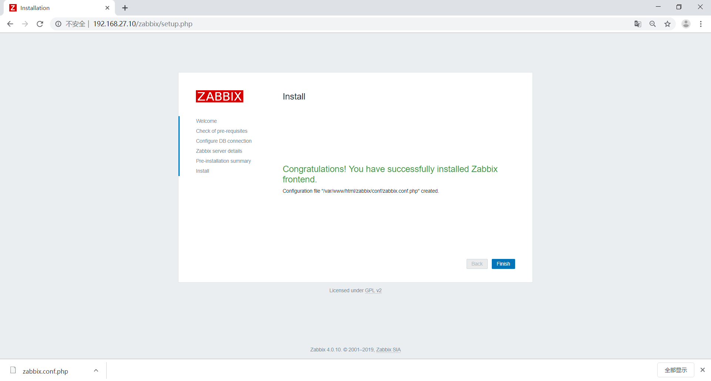
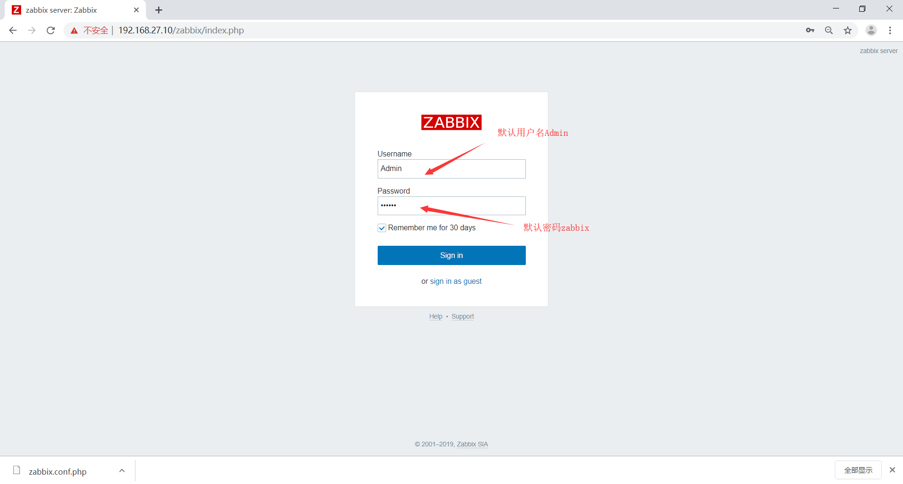
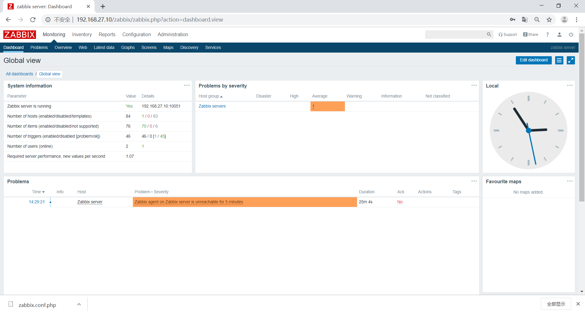
配置服务启动脚本
```bash
root@zabbix:~# vim /lib/systemd/system/zabbix-server.service
[Unit]
Description=Zabbix Server
After=syslog.target
After=network.target

[Service]
Environment="CONFFILE=/apps/zabbix_server/etc/zabbix_server.conf"
EnvironmentFile=-/etc/default/zabbix-server
Type=forking
Restart=on-failure
PIDFile=/apps/zabbix_server/run/zabbix_server.pid
KillMode=control-group
ExecStart=/apps/zabbix_server/sbin/zabbix_server -c $CONFFILE
ExecStop=/bin/kill -SIGTERM $MAINPID
RestartSec=10s
TimeoutSec=infinity

[Install]
WantedBy=multi-user.target
```
创建pid文件目录
```bash
root@zabbix:~# mkdir /apps/zabbix_server/run
root@zabbix:~# chown zabbix.zabbix /apps/zabbix_server/run
```
修改zabbix配置文件
```bash
PidFile=/apps/zabbix_server/run/zabbix_server.pid
```
启动服务
```bash
root@zabbix:~# systemctl start zabbix-server
```
## 配置agent端
下载源码包
```bash
root@appserver:~# wget https://sourceforge.net/projects/zabbix/files/ZABBIX%20Latest%20Stable/4.0.10/zabbix-4.0.10.tar.gz
```
安装编译所依赖的包
```bash
root@appserver:~# apt install gcc libpcre* -y
```
解压
```bash
root@appserver:~# tar xf zabbix-4.0.10.tar.gz -C /usr/local/src/
```
检查编译环境
```bash
root@appserver:~# cd /usr/local/src/zabbix-4.0.10/
root@appserver:/usr/local/src/zabbix-4.0.10# ./configure --prefix=/apps/zabbix_agent --enable-agent
```
编译
```bash
root@appserver:/usr/local/src/zabbix-4.0.10# make && make install
```
创建启动用户
```bash
root@appserver:~# useradd zabbix
```
创建启动脚本
```bash
root@appserver:~# vim /lib/systemd/system/zabbix-agent.service
[Unit]
Description=Zabbix Agent
After=syslog.target
After=network.target

[Service]
Environment="CONFFILE=/apps/zabbix_agent/etc/zabbix_agentd.conf"
EnvironmentFile=-/etc/default/zabbix-agent
Type=forking
Restart=on-failure
PIDFile=/apps/zabbix_agent/run/zabbix_agentd.pid
KillMode=control-group
ExecStart=/apps/zabbix_agent/sbin/zabbix_agentd -c $CONFFILE
ExecStop=/bin/kill -SIGTERM $MAINPID
RestartSec=10s

[Install]
WantedBy=multi-user.target
```
修改配置文件
```bash
root@appserver:~# vim /apps/zabbix_agent/etc/zabbix_agentd.conf
PidFile=/apps/zabbix_agent/run/zabbix_agentd.pid
Server=192.168.27.10
ServerActive=192.168.27.10
```
创建pid目录
```bash
root@appserver:~# mkdir /apps/zabbix_agent/run
```
修改属主属组
```bash
root@appserver:~# chown -R zabbix.zabbix /apps/zabbix_agent
```
启动服务
```bash
root@appserver:~# systemctl start zabbix-agent
root@appserver:~# ss -tnl | grep 10050
LISTEN   0         128                 0.0.0.0:10050            0.0.0.0:*  
```
## 在zabbix-web添加主机
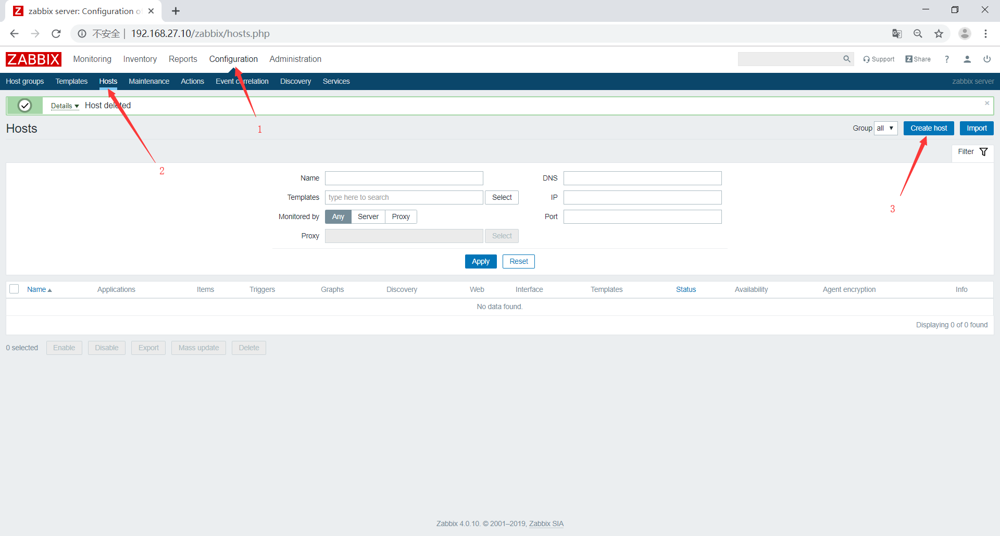
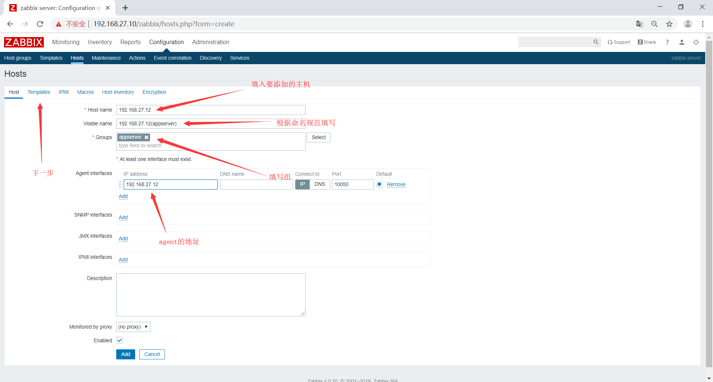
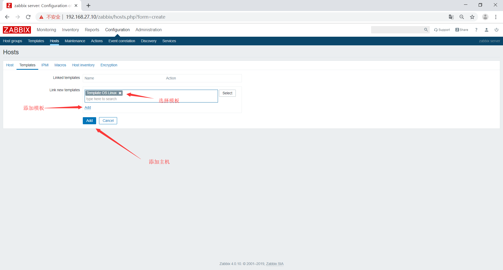
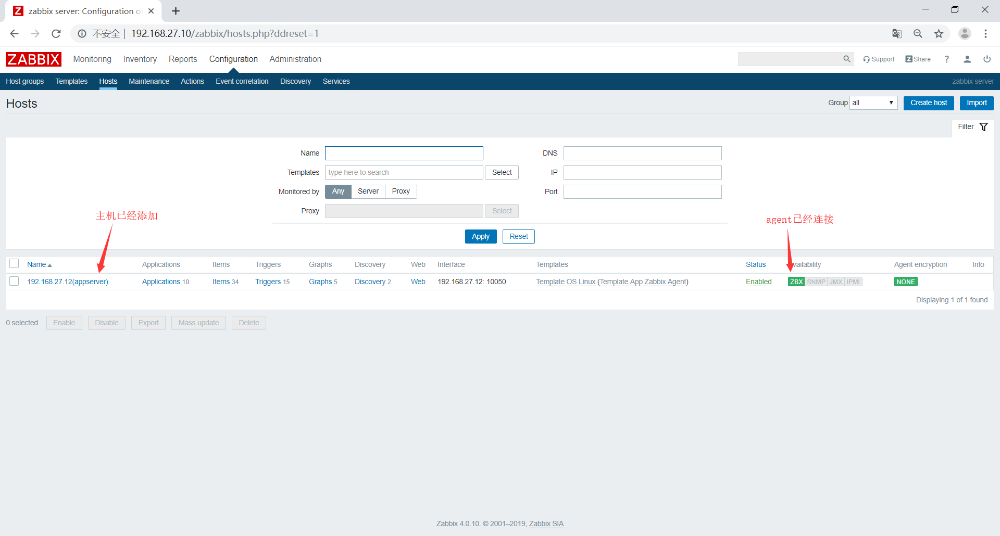
